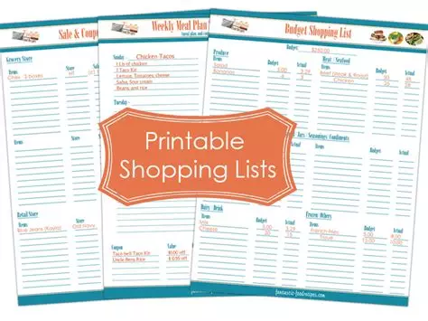

# PROJECT MINI SHOP 👋

Ce document explique le but et l'objectif du projet, ainsi que les points clés à retenir pour comprendre le code.

---

## Sommaire

- [PROJECT MINI SHOP 👋](#project-mini-shop-)
  - [Sommaire](#sommaire)
    - [Introduction](#introduction)
    - [Explication du Code](#explication-du-code)
    - [En Résumé](#en-résumé)

### Introduction

Le But de ce projet est de _mettre en place_ une _Shop List_. En fait une _Shop List_ c'est un peu comme _ToDo List_. Alors une **ToDo List**:est un procédé qui se veut simple et efficace pour gérer les tâches d'un projet.
Pour la réalisation du projet nous avons utilisé le _html_,_css_ et le _javascript_.



### Explication du Code

- #### Au Niveau du HTML

  Au niveau du code, il est constitué d'un ensemble de balise.
  Voici les balises les plus importantes :

  - `input` : Pour la création d'un espace dans lequel l'utilisateur inscrira l'élement à ajouter dans la _Shop List_.
  - `button`: Pour l'ajout des élements dans la _Shop List_, pour la creation des boutons _on/off_ et _delete_.
  - `ul`: Pour la creation des listes non ordonnées.

  Bref y a rien de nouveau sur le soleil. 😉

- #### Au Niveau du CSS

  A ce niveau, les fonctions que j'ai été content d'utilisé, nous avons:

  - `cursor`: qui permet de définir comment curseur de la souris s'affiche lorsqu'il va se placer sur l'element ciblé.
  - `display:flex`: qui permet de mettre sur pied une sorte de zone dans lequel on peut faire un certain nombre d'opération.
  - `align-items`: qui permet de gérer plusieurs élements dans une _flex_ de mainière horizontale.
  - `justify-content`: qui permet de gérer plusieurs élements verticalement dans une _flex_.
  - `hover`: ca permet de definir le comportement d'un élement lorsque le curseur est posé dessus.

- #### Au Niveau du JAVASCRIPT

  Le Javascript est principalement utilisé pour interagir avec l'interface graphique. D'ailleur c'est la base 😒.
  La dessus, il y a une fonction qui a été mis en place et dont je suis particulièrement fière.

  ```javascript
    function state_delete_Items() {
     var list = document.querySelectorAll(".state");
     var deleteItem = document.querySelectorAll(".delete");

     for (let j = 0; j < deleteItem.length; j++) {
      // Attach a click event listener to each deleteItem element
      deleteItem[j].onclick = function (ev) {
     // Remove the parent node of the parent node of the clicked element
     ev.target.parentNode.parentNode.remove();
      };
     }

     for (var i = 0; i < list.length; i++) {
      /**
      * Handles the click event for each item in the list.
      *
      * @param {Event} ev - The click event.
      * @return {void}
      */
      list[i].onclick = function (ev) {
       if (ev.target.textContent == "on") {
        ev.target.style.backgroundColor = "#000000";
        ev.target.textContent = "off";
       } else {
        ev.target.textContent = "on";
        ev.target.style.backgroundColor = "#C300FF";
       }
      };
     }
    }
  ```

La fonction permet principalement de gérer l'état des boutons ainsi que la suppression des élements de la liste.

Dans le code _JavaScript_, il y a certaines fonctions qui m'ont paru plutot cool.

- Il ya l'instruction `onclick` qui permet de lier chaque élement de la _Shop list_ à un événement via le button _on/off_.

- `ev` aussi represente l'évenement. Ce que j'ai trouvé cool là dessus c'est le fait qu'on puisse agir sur le css dessus.

- Il y a en plus une autre instruction plutot intéressante : `appendChild` qui permet d'ajouter une balise par exemple une `div` à une autre balise en tant qu'enfant.

- La fonction `remove` n'est pas mal non plus. C'est elle qui me permet de supprimer les élements de la _ShopList_.

### En Résumé

Le but de ce projet était de mettre sur pied une _Shop List_. C'est ce qui a été fait et j'ai beaucoup appris au niveau du _html_,_css_ et _javascript_ 😊.[^1]

[^1]: By EulGen
